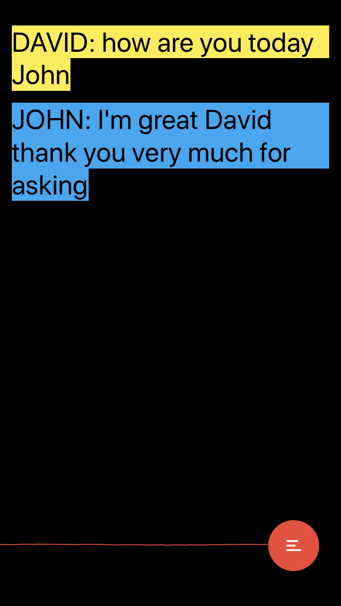
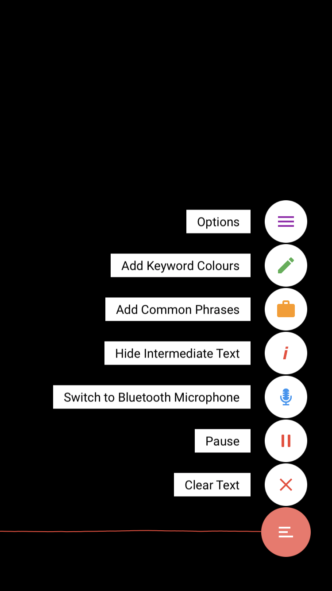

# Subtitles

Custom Speech-to-Text app for Season 2 of BBC 2's Big Life Fix.

This app is designed to work with just the device or a specially designed Raspberry Pi app and Bluetooth 7-mic array device - the [Bobbycom](https://github.com/akramhussein/bobbycom).

Features include:

* Uses [Google's Speech-to-Text API](https://cloud.google.com/speech/).
* Use on-device or specially designed Bluetooth 7-mic array device.
* Add custom audio keywords that can be associated with a colour to set text on the screen and whom is speaking e.g. `Banana` -> `John` in `Yellow`.
* Select any ASR language from the [full list provided by Google](https://cloud.google.com/speech/docs/languages).
* Play/pause microphone capture.
* Add common phrases to assist Google' ASR algorithm.
* Continuous transcription despite 1 minute limit of API.
* Clear the text.
* Hide intermediate (prediction) text.

## Requirements

This app requires your own `Google's Speech-to-Text API` key available [here](https://console.cloud.google.com/apis/credentials).

You will need to setup a `Google Cloud Platform` account.

## Screenshots

Keyword Colours            |  Options
:-------------------------:|:-------------------------:
 | 

## Getting Started

## Installation Instructions

1. Download the [source code](https://github.com/akramhussein/subtitles)

  `$ git clone git@github.com:akramhussein/subtitles.git`

2. Install [cocoapods](https://cocoapods.org/)

  `$ cd ./subtitles && pod install`

3. Open "Subtitles.xcworkspace" in Xcode

4. Open Xcode's Preferences > Accounts and add your Apple ID

5. In Xcode's sidebar select "Subtitles" and go to Targets > Subtitles > General > Identity and add a word to the end of the Bundle Identifier to make it unique. Also select/change your Apple ID in Signing > Team

6. Connect your iPad or iPhone and select it in Xcode's Product menu > Destination

7. Press CMD+R or Product > Run to install `Subtitles`

## Build Fixes

At the time of development, the 2 frameworks that this project relied on had build issues.

### `BoringSSL` as a dependency of the `googleapis` package

XCode 8.3 and onwards will complain about `module.modulemap` redefining the `openssl` module.

_Solution:_ Comment out the file contents of `module.modulemap`.

### Material

If using Swift 3.2, there are 2 compilation errors for the `Material` framework.

_Solution:_ Simply follow Xcode's instructions and accept the fixes.

